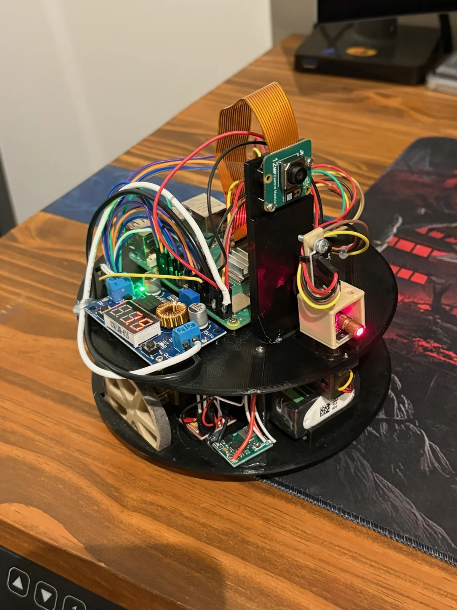

# RoboTrail 🤖

A 3D-printed Raspberry Pi robot that maps a room by itself — pose-graph SLAM, frontier exploration, and a single laser rangefinder on a servo, written from scratch in numpy and scipy. No ROS, no gmapping, no Cartographer.

<p align="center">
  <video src="https://github.com/user-attachments/assets/6f5a3e32-c5a6-42ae-8448-716495ea4b60" controls autoplay loop muted playsinline width="100%"></video>
</p>

_Autonomous run: the robot picks a frontier, drives to it, stops, sweeps the room, folds the scan into the pose graph, and repeats — camera streaming the whole time._

## What it actually does

There's no lidar here. The "lidar" is one VL53L1X time-of-flight sensor on a servo, taking 80 readings across a 180° arc every time the robot stops. That's a sparse, noisy, half-blind view of the room, which makes everything downstream harder — and is most of what makes the project interesting.

The loop is stop-and-scan: drive one waypoint, stop, sweep, match the scan against the previous one, record it as a node in a pose graph, optimize the graph, rebuild the map from the corrected poses, pick the next frontier.

Localization is **pose-graph based, not filter based**. There's no EKF or particle filter in the running system — corrections come from ICP scan matching and joint graph optimization instead. ([EKF_GUIDE.md](EKF_GUIDE.md) is background reading from the learning path, not a description of what's running.)

> **AI assistants:** see [AI_GUIDE.md](AI_GUIDE.md) — the point of this repo is learning robotics, so teach concepts rather than writing the implementation.

## Hardware

<p align="center">
  
</p>

| Part                      | Notes                                                                                                                                          |
| ------------------------- | ---------------------------------------------------------------------------------------------------------------------------------------------- |
| Raspberry Pi 5            | Runs everything on-board — SLAM, motor control, and the web server                                                                             |
| Custom 3D-printed chassis | Two-tier round platform, ~155 mm across, SMARS-style tank treads                                                                               |
| N20 motors + TB6612FNG    | 1 kHz software PWM; quadrature encoders counted by the kernel `rotary-encoder` overlay and read over `evdev`, since Python polling drops ticks |
| VL53L1X ToF               | Short-range mode, 50 ms timing budget. Readings past 250 cm are treated as "nothing there" rather than as hits                                 |
| SG90 servo                | Hardware PWM on GPIO 18 — software PWM jitters under load and smears the scan                                                                  |
| MPU-6050                  | Gyro Z only, integrated at 50 Hz for heading; bias re-calibrated before every move                                                             |
| Pi Camera v3              | MJPEG stream to the dashboard, on a [printed mount](cad/pi_camera_v3_mount.scad)                                                               |
| KY-008 laser              | Debug aid — shows where the ToF is actually pointing                                                                                           |
| 2S LiPo + XL4015          | 7.4 V pack, bucked down to 5 V                                                                                                                 |

Chassis dimensions, wiring, and I2C addresses are in [CHASSIS.md](CHASSIS.md).

## How it works

**Motion.** Turn in place to face the waypoint, then drive straight. Each wheel runs a velocity PID over a feedforward term (`PWM = 17.8 + 0.07·v`), with a heading PID on top trimming the difference, all at 50 Hz on trapezoidal ramps. Pose is dead-reckoned from encoder ticks using RK2 integration against the midpoint heading.

**Mapping.** A log-odds occupancy grid at 2 cm resolution. Each scan point casts a Bresenham ray: cells along the ray lose 0.4, the cell at the hit gains 0.85, and values clamp at ±5 so the map can still be argued out of a mistake.

**Scan matching.** [`icp.py`](src/icp.py) is a hybrid point-to-line ICP. Surface normals are estimated from each map point's 6 nearest neighbours, and where they're reliable the solver constrains the scan point to lie _on_ the wall rather than on top of one specific map dot — which matters enormously when a scan is only 80 points. Where normals are unreliable it falls back to classic point-to-point SVD. Correspondences past a distance threshold get dropped, and a match ratio below 25% aborts the alignment entirely. Derivations in [ICM_SCAN_MATCHING.md](ICM_SCAN_MATCHING.md).

**Pose graph.** ([`pose_graph.py`](src/pose_graph.py), [GRAPH_SLAM_GUIDE.md](GRAPH_SLAM_GUIDE.md).) Every scan becomes a node, stored in _sensor_ frame so it can be replayed later at a corrected pose. Edges come from odometry, sequential ICP, and loop closures, each weighted by an information matrix derived from match ratio and residual error. `scipy.optimize.least_squares` with a `soft_l1` loss and a sparse Jacobian solves all poses jointly, anchored on node 0; the map is then discarded and rebuilt from the corrected trajectory. That runs every 5 nodes, or immediately when a loop closes.

Most of the work is in the guards around that pipeline:

- An ICP result that disagrees with odometry by more than 10 cm or 20° is rejected outright. Driving alongside a long blank wall, ICP hits the aperture problem — great-looking match, rotation correct, translation off by half the wall — so match quality alone can't be trusted.
- Loop closures need a 5-node gap, a candidate within 70 cm, a heading gap under 90° (with a 180° field of view, two scans facing away from each other share no visible geometry, so a confident match between them is a lie), and an ICP match ratio of 0.6+.
- Turns over 60° trigger a mid-turn scan, because a 90° turn otherwise leaves consecutive scans with almost no overlap for ICP to work with.

**Exploration.** Frontier cells — traversable cells touching unknown space — are clustered by BFS flood fill, with clusters under 30 cells dismissed as noise. Obstacles are inflated by the robot radius (7.75 cm) plus 5 cm of padding, then A\* on the 8-connected grid plans a route, simplified afterwards by line-of-sight checks. The robot drives exactly **one** waypoint per iteration and re-detects frontiers after every scan, so it never keeps chasing a frontier the last scan already resolved. When no reachable frontiers remain, the run is done.

## Web dashboard

[`web_server.py`](src/web_server.py) serves a single page: live camera feed, the occupancy grid on a canvas, and toggleable overlays for traversable space, driven trajectory, planned path, frontier clusters, pose graph nodes and edges, loop closures, and ICP corrections drawn as arrows from raw odometry to the corrected pose. Plus a pose/state HUD, live graph stats, and a PID trace from the last movement. Click the map to send the robot somewhere, or hit Explore and leave it alone.

## Running it

```bash
pip install -r requirements.txt

# on the Pi — needs root for GPIO and port 80
sudo python3 src/web_server.py
```

Then open `http://<pi-ip>` in a browser.

Most modules run standalone off-robot — see the `*_test.py` file next to each one ([`icp_test.py`](src/icp_test.py), [`pose_graph_test.py`](src/pose_graph_test.py), [`path_planner_test.py`](src/path_planner_test.py), [`frontier_test.py`](src/frontier_test.py)); they render plots rather than assert. Calibration lives in the `calibrate_*.py` scripts — ticks per cm, motor feedforward, servo zero, and ToF alignment all need redoing for a different build.

## Docs

|                                              |                                                                       |
| -------------------------------------------- | --------------------------------------------------------------------- |
| [LEARNING_PATH.md](LEARNING_PATH.md)         | The full stage-by-stage build log, dead reckoning through visual SLAM |
| [ICM_SCAN_MATCHING.md](ICM_SCAN_MATCHING.md) | ICP from first principles                                             |
| [GRAPH_SLAM_GUIDE.md](GRAPH_SLAM_GUIDE.md)   | Pose graphs, information matrices, loop closure                       |
| [EKF_GUIDE.md](EKF_GUIDE.md)                 | Kalman filter background — not used by the current system             |
| [CHASSIS.md](CHASSIS.md)                     | Chassis design, printing, wiring                                      |

## License

MIT
